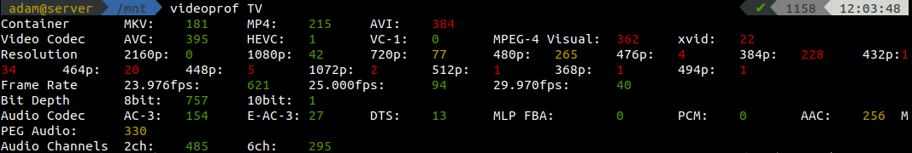
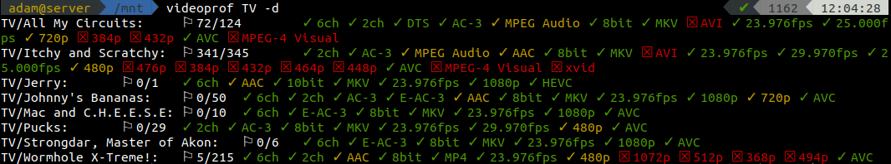
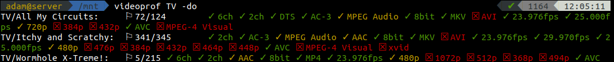

# videoprof - A CLI Video Profiler for Python

Profile various attributes of local videos like resolution, codec, container, audio channels, and more!

## Installation

To install, you can add the "videoprof" package from pip:

```bash
pip3 install --user --upgrade videoprof
```

## Requirements

### libmediainfo

This application can not work without libmediainfo. To install libmediainfo on Debian or Ubuntu:

```bash
apt-get install libmediainfo0v5
```

If you see a message like the following, it must not be installed:

```
Could not analyze videos: make sure libmediainfo is installed!
```

### A Compatible Python version:

- 3.6
- 3.7
- 3.8
- 3.9

## Usage

```
Usage: videoprof [OPTIONS] [SOURCES]...

Options:
  -c, --config TEXT              JSON configuration file
  -s, --sqlite-cache TEXT        SQLite cache file
  -f, --files                    Show individual file badges and exit
  -d, --directories              Show directory badges and exit
  -p, --directory-depth INTEGER  Directory depth for summaries
  -o, --only-flagged             Only show individual files or directories on
                                 flagged entries

  -m, --media-info               Show media info for the first found file and
                                 exit

  --help                         Show this message and exit.
```

## Screenshots

Summary view:



Directory view:



Flaged directory view:



## Configuration

Videoprof is very configurable - any attribute that is returned by mediainfo can be profiled. When videoprof is first run, it will generate a default configuration in `~/.config/videoprof/config.json` (on POSIX/Linux systems).

The [default configuration](videoprof/default_config.json) mostly codifies Blu-Ray specs as "success", DVD specs as "warning", and everything else as an error. While simple, it does contain most features useable within the configuration and can be used as a reference.
